# Touchwonders Xcode Theme

<p><a style="font-style: italic;" href="https://www.touchwonders.com/blog/a-closer-look-at-xcode-themes" target="_blank">The following was originally posted as "A Closer Look at Xcode Themes" on the Touchwonders Blog</a></p>

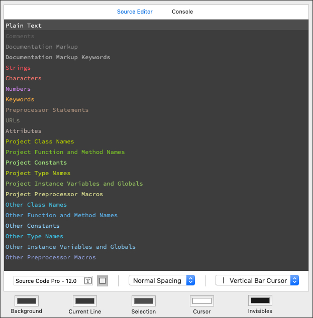

---

# A Closer Look at Xcode Themes

<p>As native iOS app developers, Xcode is our IDE of choice. Most of us use Xcode for the larger part of the day. Therefore it is important that Xcode is something we can look at for prolonged time; its appearance should not fatigue, disgust or distract us, and it should support us in our work where possible. The “Theme” that you can configure in Xcode’s “Fonts & Colors” settings, is the primary point for influencing this appearance.</p>

<div style="font-style: italic; margin: 1em 1em 2em 1em; color: #555;"><strong>Disclaimer:</strong><br />
This post is highly subjective and most rationale is driven by aesthetic preferences and emotional associations. The aim of this post is not to provide a single Xcode Theme to rule them all, but rather to inspire you to think about how you can enable your Xcode Theme to better support you in your work.
</div>

<h2>Dark background vs. Light background</h2>
<p>Most developers do seem to find their way to the “Fonts & Colors” settings; rarely do you see the “Default” theme in the wild, other than perhaps in coding demos by Apple during WWDCs. The Theme is, of course, a means to personalize Xcode, but when you observe the abundance of themes listed on sites <a href="http://www.codethemes.net/" target="_blank">that</a> <a href="https://github.com/topics/xcode-color-theme" target="_blank">gather</a> <a href="https://github.com/hdoria/xcode-themes" target="_blank">Xcode</a> <a href="https://github.com/damuellen/xcode9-themes" target="_blank">Themes</a>, that have a dark background, the principal concern for people changing their theme almost seems to be to move away from using a light background.</p>

<p>There <a href="https://www.uxmatters.com/mt/archives/2007/01/applying-color-theory-to-digital-displays.php" target="_blank">are</a> <a href="http://cron-z.blogspot.com/2011/03/what-makes-good-ide-color-scheme.html" target="_blank">plenty</a> <a href="http://www.eyemagazine.com/opinion/article/eye-strain" target="_blank">of</a> <a href="https://tatham.blog/2008/10/13/why-light-text-on-dark-background-is-a-bad-idea/" target="_blank">sources</a> – some more substantiated than others – that have something to say about whether or not dark text on a light background is better than light text on a dark background, or vice versa. It is important to note that many of these sources focus on the ideal design of text pages – content that is <em>read</em>. Given this quote from Robert C. Martin from his book <a href="https://www.amazon.com/Clean-Code-Handbook-Software-Craftsmanship/dp/0132350882" target="_blank">“Clean Code: A Handbook of Agile Software Craftsmanship”</a>, you could say those sources then are important in determining your IDE theme:</p>

<blockquote style="font-size: 1.3em">
“Indeed, the ratio of time spent reading vs. writing is well over 10:1. We are constantly reading old code as part of the effort to write new code. ...[Therefore,] making it easy to read makes it easier to write.”
</blockquote>

<p>Though opinions are divided, the majority seems to conclude <a href="https://www.uxmatters.com/mt/archives/2007/01/applying-color-theory-to-digital-displays.php" target="_blank">that</a>:</p>

<blockquote style="font-size: 1.3em">
“While white text on a black background provides very high value contrast, it is less readable and causes greater eye fatigue than black text on a white background.”
</blockquote>

<p>
However, though the ratio of 10 over 1 might be correct in terms of how much we dwell through existing code compared to how much we actually write, most developers will probably not <em>read</em> the code like a book, but <em><a href="https://uxmovement.com/content/when-to-use-white-text-on-a-dark-background/" target="_blank">scan</a></em> through it to comprehend the structure and intent. For scanning, light text on a dark background works better, because it better allows for highlighting important content, while less important content can recede into the background. This is exactly the reason <a href="https://developer.apple.com/design/human-interface-guidelines/macos/visual-design/dark-mode/" target="_blank">why Apple introduced Dark Mode</a> in macOS Mojave.
</p>
<p>
How dark the background should be, and how bright the text should be, only is directed by the <a href="https://www.uxmatters.com/mt/archives/2007/01/applying-color-theory-to-digital-displays.php" target="_blank">need</a> <a href="http://www.eyemagazine.com/opinion/article/eye-strain" target="_blank">for</a> <a href="https://www.w3.org/TR/UNDERSTANDING-WCAG20/visual-audio-contrast-contrast.html" target="_blank">contrast</a>. The more, the better, but <a href="https://ethanschoonover.com/solarized/#features" target="_blank">not too much</a>:
</p>
<blockquote style="font-size: 1.3em">
“On a sunny summer day I love to read a book outside. Not right in the sun; that’s too bright. I’ll hunt for a shady spot under a tree. The shaded paper contrasts with the crisp text nicely. If you were to actually measure the contrast between the two, you’d find it is much lower than black text on a white background (or white on black) on your display device of choice. Black text on white from a computer display is akin to reading a book in direct sunlight and tires the eye.”
</blockquote>
<p>
We chose for a <strong>background</strong> color that is dark, but not completely black. There are two reasons: firstly, a completely black background will provide you with a mirror in which you can admire yourself all day. This is not a bad thing per se, but not particularly what you would like to focus on. Second, a somewhat more gray background color connects nicely with both the Light and Dark appearance in macOS Mojave. The <strong>current line</strong> is slightly darker, the <strong>selection</strong> slightly lighter.
<table>
<tr><td>Background</td><td style="background-color: #3d3d3d;"> </td><td><code>#3D3D3D</code></td></tr>
<tr><td>Current Line</td><td style="background-color: #383838;"> </td><td><code>#383838</code></td></tr>
<tr><td>Selection</td><td style="background-color: #4D4D4D;"> </td><td><code>#4D4D4D</code></td></tr>
</table>
</p>
<h2>Text: Syntax Identifiers</h2>
<p>The text will have various bright colors and shades of white. Which colors you will see where depends on what kind of file you are looking at. Most common in iOS development are Swift, Objective-C (.m and .h) and XML-based (e.g. Plist) files. Xcode themes provide 23 different “syntax identifiers” for which you can specify different colors and fonts. Not all identifiers will apply to all file types, but <strong>plain text</strong> will be visible somewhere in pretty much all files.<br />
The plain text syntax identifier is used among others in definitions of properties, methods, constants, classes and enums, scoped value names and XML text content. A YAML file will be displayed entirely as plain text. Plain text is visible in many different contexts, often for important elements in the syntax. As such it should stand out <em>and</em> fit in, so a bright shade of white is most suitable. Full white (<code>#FFFFFF</code>) is, however, a bit too bright; the hard contrast this creates against the background is unpleasant and distracts from the other syntax elements, therefore we tone it down a little.
<table>
<tr><td>Plain text</td><td style="background-color: #EFEFEF;"> </td><td><code>#EFEFEF</code></td></tr>
</table>
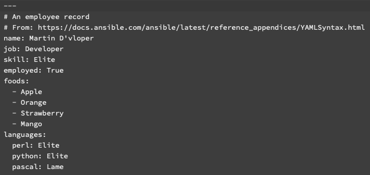
</p>
<h2>Comments & Documentation Markup</h2>
<p>There are three syntax identifiers for comments: regular <strong>comments</strong>, <strong>documentation markup</strong> and <strong>documentation markup keywords</strong>. Only a few of the default Xcode themes provide a slight variation between these comment types in terms of color and typography, while configuring a bit more contrast can prove very useful. But let’s first take a look at what differentiates these types of comments.</p>
<p>A <strong>regular comment</strong> is any text that is preceded by two forward slashes (continuing until a line-break), or text preceded by a slash followed by a single asterisk and terminated by (at least) an asterisk and slash (Or in HTML, anything between <code>&lt;!--</code> and <code>--&gt;</code>). </p>
<pre>
// Copyright © Touchwonders B.V., 2018.

// MARK: - UIApplicationDelegate Methods

// swiftlint:disable line_length

/* This is a regular comment as well */
</pre>
<p>
Regular comments are often used when “toggling” comments (the act of commenting out a line), for compiler or tool directive comments such as MARK, TODO and FIXME comments in Swift, and you’ll find them in the  <a href="https://oleb.net/blog/2017/07/xcode-9-text-macros/" target="_blank">file header</a> (i.e. the first few lines of most code files).</p>
<p>
</p>
<strong>Documentation comments</strong>, as the name suggests, are used for documentation. This can be (among others) for types, properties or functions, and if the documentation comments are put right above the definition, you will be able to read this documentation in Xcode’s Quick Help wherever you use that definition. Xcode provides a shortcut to help you add documentation via the menu: <span style="font-weight: lighter; background-color: #EEEEF2; padding: 0 5px 0 5px;">Editor &rarr; Structure &rarr; Add Documentation</span>. This kind of comments uses three forward slashes for single-line comments, and a slash followed by two asterisks for multi-line comments (while a single asterisk and slash still suffice for closing).

<p>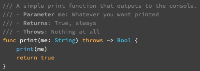</p>

By default, your documentation comments will show up in the “Description” section in the Xcode Quick Help. There are however also <a href="https://useyourloaf.com/blog/swift-documentation-quick-guide/" target="_blank">sections</a> for documenting parameters, return value/type and possible errors thrown. You can use <strong>markup keywords</strong> in your documentation comments to target these sections:
<p>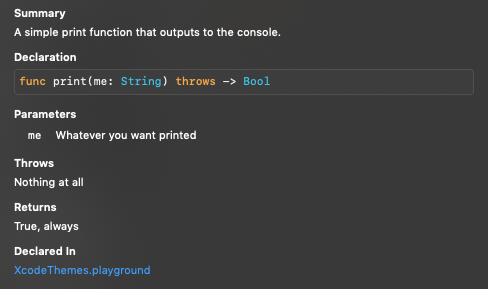</p>
</p>
<p>
Documentation comments often contain more important information to the developer than regular comments, but both should not attract too much attention compared to the code itself. Therefore we select two shades of gray, in which documentation is brighter. The markup keywords should stand out from the documentation, as the section headers do in the Quick Help, but again it should not attract too much attention. We make the markup keywords slightly brighter than the documentation, and as only exception among all syntax identifiers, we select a bolder font weight.
<table>
<tr><td>Comments</td><td style="background-color: #5F5F5F;"> </td><td><code>#5F5F5F</code></td></tr>
<tr><td>Documentation Markup</td><td style="background-color: #868686;"> </td><td><code>#868686</code></td></tr>
<tr><td>Documentation Markup Keywords</td><td style="background-color: #A0A0A0;"> </td><td><code>#A0A0A0</code></td></tr>
</table>
</p>
<h2>Strings, Characters & Numbers</h2>
<p>
<strong>String</strong> and <strong>number</strong> literals generally constitute important parts of your code. They either will end up user-facing or are part of an algorithm or function in which there’s little room for error. Strings and numbers are most liable to incorrect values or typos, therefore these should be clearly visible and stick out. We chose a bright shade of red and purple, respectively. The choice here is rather arbitrary, but these colors contrast well against color choices that will be discussed further on.<br />
The <strong>character</strong> syntax identifier is one you won’t see often in Swift or Obj-C files, where strings, even of single character length, must be defined with double quotes. This syntax identifier will only be used for single-quoted strings. There are several languages in which both double and single quotes are allowed, such as Javascript. Languages like Ruby do not differentiate either for simple string definitions, but only process escape codes or allow string interpolation on double-quoted strings. The reason however why this syntax identifier is called “Character” is because in C languages and a language like <a href="https://www.cs.umd.edu/~clin/MoreJava/Intro/prim-char.html" target="_blank">Java</a>, a single character, a <a href="https://en.wikipedia.org/wiki/Character_literal" target="_blank">“character literal”</a>, can be defined by putting it in single quotes. Since the use of this syntax identifier is close to how strings are used, we also give it a red color, but slightly different to what we chose for strings.
<table>
<tr><td>Strings</td><td style="background-color: #F55159;"> </td><td><code>#F55159</code></td></tr>
<tr><td>Characters</td><td style="background-color: #F5746E;"> </td><td><code>#F5746E</code></td></tr>
<tr><td>Numbers</td><td style="background-color: #CB83EA;"> </td><td><code>#CB83EA</code></td></tr>
</table>
<table>
<tr><td>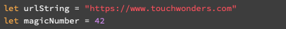</td><td>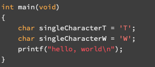</td></tr>
</table>
</p>
<h2>Keywords</h2>
<p><strong>Keywords</strong> are the anchor points of your code, representing the components of the language. These <a href="https://docs.swift.org/swift-book/ReferenceManual/AboutTheLanguageReference.html" target="_blank">include</a> fundamental expressions, statements, attributes and declarations. They represent control flow such as loops and branching. They are used to introduce functions and methods, variables and constants, and to define fundamental types. This perhaps is the most important syntactic component and hence gets a bright color that really sticks out against the rest: orange. Here again, the choice is a bit arbitrary but chosen to contrast, yet fit in too, with the other colors.
<table>
<tr><td>Keywords</td><td style="background-color: #F5AA42;"> </td><td><code>#F5AA42</code></td></tr>
</table>
</p>
<h2>Preprocessor Statements</h2>
<p>
<strong>Preprocessor statements</strong> instruct the preprocessor to perform certain operations on your source code, prior to it being compiled. This, for example, might involve <a href="https://gcc.gnu.org/onlinedocs/cpp/Include-Syntax.html" target="_blank">including</a> header files, <a href="https://gcc.gnu.org/onlinedocs/cpp/If.html" target="_blank">conditional</a> inclusion of code, or <a href="https://gcc.gnu.org/onlinedocs/cpp/Macros.html" target="_blank">defining</a> macros. #pragma is also a preprocessor directive, but in Xcode is most often used to <a href="https://nshipster.com/pragma/" target="_blank">organize code and inhibit compiler warnings</a>.<br />
These kinds of statements often dig a little deeper, below the surface of what you see in your code file. Therefore we associate an earthy, brown color with this.
<table>
<tr><td>Preprocessor Statements</td><td style="background-color: #A08775;"> </td><td><code>#A08775</code></td></tr>
</table>
<p>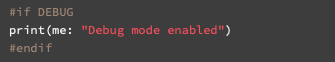</p>
</p>
<h2>URLs and Attributes</h2>
<p>
URLs will not often appear in your Obj-C or Swift code. If they are represented as a string literal, they will not be recognized as a URL syntax element. If they are part of a comment, they will be recognized as a URL. You can choose to let these blend in with the rest of the comment or have them stick out, but it is important to know where else they might appear. Take for instance an XML file, particularly a <a href="https://en.wikipedia.org/wiki/Web_Services_Description_Language" target="_blank">WSDL</a>, in which there can be numerous URLs that reference external definitions: 
</p>
<pre style="white-space: normal;">
&lt;wsdl:definitions xmlns:wsdl="http://schemas.xmlsoap.org/wsdl/" xmlns:wsaw="http://www.w3.org/2006/05/addressing/wsdl" xmlns:mime="http://schemas.xmlsoap.org/wsdl/mime/" xmlns:http="http://schemas.xmlsoap.org/wsdl/http/" xmlns:soap12="http://schemas.xmlsoap.org/wsdl/soap12/" xmlns:xs="http://www.w3.org/2001/XMLSchema" xmlns:soap="http://schemas.xmlsoap.org/wsdl/soap/"&gt;
…
</pre>
<p>In this example, all URLs are attribute values, in which Xcode choses to syntactically color the double-quotes as String, but the URLs are recognized as such and will not be the same color. Each XML tag (in this case <code>&lt;wsdl&gt;</code>) will be colored as Keyword. Attribute names in a tag have their own syntax identifier, <strong>Attributes</strong>. For these, we chose a color that is derived from the color for Keywords but toned down a lot, as to let the keywords take the foreground. For URLs, we chose a color that aesthetically fits in both this XML context <em>and</em> the aforementioned comments.
<table>
<tr><td>URLs</td><td style="background-color: #868677;"> </td><td><code>#868677</code></td></tr>
<tr><td>Attributes</td><td style="background-color: #B4A59F;"> </td><td><code>#B4A59F</code></td></tr>
</table>
<p>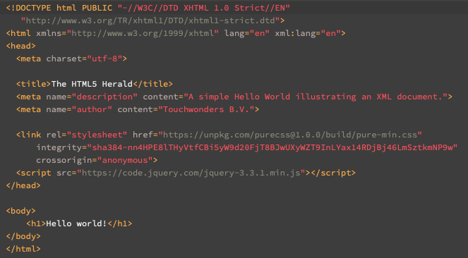</p>
</p>
<h2>Project versus Other</h2>
<p>Remaining are two groups of syntax identifiers, one prefixed with “Project”, the other with “Other”. Simply put, “project” is your code, “other” is someone else’s, but this is not entirely true. Project syntax is applied to your project code and to frameworks (which are not yet compiled). These frameworks might be third-party or your own. In theory, you can edit these (but if you ever used Cocoapods, this takes care of configuring included frameworks as read-only). On the “other” hand there are <a href="http://www.vadimbulavin.com/static-dynamic-frameworks-and-libraries/" target="_blank">libraries</a>, already compiled pieces of code and data that are not part of your Xcode target. You cannot edit these.<br />
Your project code is more liable to change, more dynamic, hence (but also a bit out of <a href="https://en.wikipedia.org/wiki/Monochrome_monitor" target="_blank">nostalgia</a>) we chose green. Contrasting that is the “other” code that is more static, “frozen” if you like, hence we gave it a blue color.</p>
<p>
Each group consists of the following six identifiers: Class Names, Function and Method Names, Constants, Type Names, Instance Variables and Globals, and Preprocessor Macros. We use subtle variations in hue, saturation and brightness to distinguish these. A combination of higher saturation and higher brightness is used to convey importance, as it sticks out more strongly. Lower saturation indicates less importance. When lower saturation is combined with higher brightness, a color moves more towards white, which is used to indicate a more static nature.<br />
<strong>Function and Method Names</strong> can be impactful, you use them to perform certain actions in your code, hence they are quite important. Compared to these, <strong>Instance Variables and Globals</strong> often are used in a more passive context, primarily for reading their value, so we tone these down slightly. <strong>Class</strong> and <strong>Type</strong> names convey important information but are relatively static. Very static are <strong>Constants</strong>, which commonly inform on relatively important points in your code such as success/failure or are used in checks for a certain mode, and hence are brighter. Lastly, <strong>Preprocessor Macros</strong> can serve as function or as constant so their nature is a bit uncertain, however, they should be <a href="https://stackoverflow.com/questions/14041453/why-are-preprocessor-macros-evil-and-what-are-the-alternatives" target="_blank">handled with care</a> so we chose to let them stick out too. 
<table>
<tr><td>Project Class Names</td><td style="background-color: #A9BD22;"> </td><td><code>#A9BD22</code></td></tr>
<tr><td>Project Function and Method Names</td><td style="background-color: #76BA29;"> </td><td><code>#76BA29</code></td></tr>
<tr><td>Project Constants</td><td style="background-color: #A3E080;"> </td><td><code>#A3E080</code></td></tr>
<tr><td>Project Type Names</td><td style="background-color: #B4CC18;"> </td><td><code>#B4CC18</code></td></tr>
<tr><td>Project Instance Variables and Globals</td><td style="background-color: #92BB62;"> </td><td><code>#92BB62</code></td></tr>
<tr><td>Project Preprocessor Macros</td><td style="background-color: #D6D98D;"> </td><td><code>#D6D98D</code></td></tr>
<tr><td colspan="3" style="font-size: smaller">&nbsp;</td>
<tr><td>Other Class Names</td><td style="background-color: #45B9D9;"> </td><td><code>#45B9D9</code></td></tr>
<tr><td>Other Function and Method Names</td><td style="background-color: #5CB1E5;"> </td><td><code>#5CB1E5</code></td></tr>
<tr><td>Other Constants</td><td style="background-color: #8FD4FF;"> </td><td><code>#8FD4FF</code></td></tr>
<tr><td>Other Type Names</td><td style="background-color: #3CC1E6;"> </td><td><code>#3CC1E6</code></td></tr>
<tr><td>Other Instance Variables and Globals</td><td style="background-color: #7EBBE0;"> </td><td><code>#7EBBE0</code></td></tr>
<tr><td>Other Preprocessor Macros</td><td style="background-color: #8D9DD9;"> </td><td><code>#8D9DD9</code></td></tr>
</table>
<table>
<tr><td>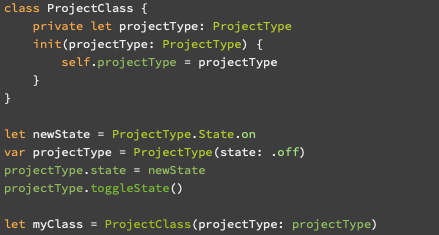</td><td>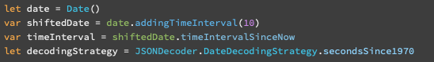</td></tr>
</table>
</p>
<h2>Cursor and Invisibles</h2>
<p>There are two colors yet unaddressed, which are not part of the syntax but are defined at the same level of your background color and selection. The <strong>Cursor</strong> needs to be clearly visible and contrast well to everything. We chose full white for this. As we chose a slightly toned down shade of white for Plain Text, this still sufficiently contrasts. The cursor will always be on the current line, for which we chose a color which is slightly darker than the background color, further increasing emphasis. Xcode also allows you to select either a Vertical Bar Cursor, an Underline Cursor or Block Cursor. The latter two can cause confusion in determining where the insertion point is, where the Vertical Bar is a very precise indication.</p>
<p>
Invisibles are characters that don’t have any visual mark, but often (but not always) do take visual space. These include whitespaces, newlines, joiners and <a href="https://en.wikipedia.org/wiki/Control_character" target="_blank">control characters</a>. You can toggle <span style="font-weight: lighter; background-color: #EEEEF2; padding: 0 5px 0 5px;">Editor &rarr; Show Invisibles</span>, after which Xcode shows visual marks for these invisible characters; a middot (<code>&middot;</code>) for spaces, a “not sign” (<code>&not;</code>) for newlines. We chose to contrast these invisibles to plain text and give them a color that resembles a “shadow”.
<table>
<tr><td>Cursor</td><td style="background-color: #FFFFFF;"> </td><td><code>#FFFFFF</code></td></tr>
<tr><td>Invisibles</td><td style="background-color: #191919;"> </td><td><code>#191919</code></td></tr>
</table>
<p>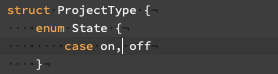</p>
</p>
<h2>Typography</h2>
<p>
As most programmers know, the font you use in your IDE is preferably monospaced. This ensures that characters that look similar (such as 1 and I, and 0 and O) can better be differentiated, punctuation and other potentially narrow characters are more visible and any chunks of text of equal character count take up equal space. There are <a href="https://github.com/chrissimpkins/codeface" target="_blank">plenty</a> <a href="https://en.wikipedia.org/wiki/List_of_monospaced_typefaces" target="_blank">fonts</a> to choose from. We chose Adobe’s <a href="https://github.com/chrissimpkins/codeface#source-code-pro" target="_blank">"Source Code Pro”</a>, a crisp and legible typeface that also rather looks nice. At 12 points, this is perfectly legible for most of us, but if too small, Xcode provides an easy menu item under <span style="font-weight: lighter; background-color: #EEEEF2; padding: 0 5px 0 5px;">Edit &rarr; Format &rarr; Font &rarr; Bigger</span> to increase the font size by one. The font size is consistent across all syntax identifiers. As said, only Documentation Markup Keywords have a heavier font weight. Lastly, the default “Normal” line spacing provides sufficient air between the lines. If you find the available spacing options too narrow or too relaxed, there are fonts such as <a href="https://github.com/andreberg/Meslo-Font" target="_blank">Meslo LG</a> that provide a variety of baked-in line spacing.
</p>
<h2>Concluding</h2>
<p>All aspects of our Xcode Theme have now been discussed. Every component of it can be determined by giving it some thought, by associating certain values or emotions to it. A theme that looks nice is perfectly valid, but it can be a powerful tool to convey information that lets you scan through your code more easily.<br />
The theme might change over time and we love to hear your thoughts on it, as well as your experiences with the theme you use. <a href="https://www.touchwonders.com/contact" target="_blank">Get in touch!</a></p>

## Installation

Either manually move the `Touchwonders.xccolortheme` file to `~/Library/Developer/Xcode/UserData/FontAndColorThemes`, or run the accompanied shell script:

```bash
./install.sh
```
